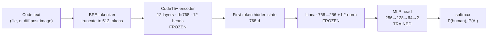

# ai-contribution-detector

Tells you whether the code in a git repository was **written by a person** or **AI-generated** — commit by
commit, and as a month-by-month timeline over the repository's history. Code a person wrote together with
AI counts as human-written (see [Classes](#classes)).
Works on Python, JavaScript/TypeScript, C++ and C# code.

New here? Follow the **[Quick start](#quick-start-windows--nvidia-gpu)** below — no Python knowledge
needed. Everything after it is reference material.

## Quick start (Windows + NVIDIA GPU)

**What you need:** a Windows PC with an NVIDIA graphics card, an internet connection, about 20 GB of free
disk space, and these two free programs installed:

- [Git](https://git-scm.com/download/win) — the default options are fine.
- [Python 3.10 or newer](https://python.org/downloads) — on the first installer screen, tick
  **"Add python.exe to PATH"**.

### 1. Install (once)

Open **PowerShell** (Start menu → type "PowerShell") and paste these lines:

```powershell
git clone https://github.com/jeromeboivin/ai-contribution-detector.git
cd ai-contribution-detector
python -m venv .venv
.venv\Scripts\activate
pip install torch --index-url https://download.pytorch.org/whl/cu126
pip install -e ".[dev]"
python -c "import torch; print(torch.cuda.is_available())"
```

The last line must print **`True`** (it means your graphics card will be used). If it prints `False`, or
any line shows an error, see [Troubleshooting](#troubleshooting).

### 2. Train the model (once)

**Recommended for a first try: use a small part of the dataset.** The full dataset can take days to
process even on a good graphics card; a 1.5% sample takes about an hour and is enough to check that
everything works end to end. Open your personal settings file in Notepad:

```powershell
notepad configs\local.yaml
```

Click **Yes** if Notepad asks to create the file, paste these lines, and save:

```yaml
dataset:
  per_class_cap:
    train: 10000
    validation: 1000
    test: 1000
```

(Later, to train on the full dataset, delete these lines and run the four commands below again. To
train only on some programming languages, see
[Choosing which languages to train on](#choosing-which-languages-to-train-on).)

Then run these four commands, one after the other:

```powershell
aicontrib prepare
aicontrib embed
aicontrib train
aicontrib evaluate
```

- This takes a while — several hours depending on your graphics card. **`embed` is the long one.**
- If anything interrupts it (closed window, reboot), just run the same command again: it resumes where it
  stopped.
- While `train` runs, open **http://127.0.0.1:8765** in a browser on the same PC to watch progress live.
- `evaluate` prints how accurate the finished model is. The model itself is saved as
  `models\mlp_classifier.pt`.

### 3. Analyze a repository

Point it at any git repository on your PC (keep the quotes if the path contains spaces):

```powershell
aicontrib report "C:\path\to\some\repository"
```

This creates a file named `<repository-name>-authorship-timeline.html` in the current folder —
double-click it to see, month by month, the share of human-written and AI-generated commits. Only
commits that change code are counted; commits touching only other files (XML, images, documents,
proprietary formats…) are ignored. More in [Authorship timeline report](#authorship-timeline-report).

### Opening PowerShell again later?

Each new PowerShell window needs these two lines first, otherwise the `aicontrib` command isn't found:

```powershell
cd path\to\ai-contribution-detector
.venv\Scripts\activate
```

### Getting the latest version

```powershell
git pull
pip install -e ".[dev]"
```

## Troubleshooting

**"Warning: You are sending unauthenticated requests to the HF Hub"** — harmless, ignore it. It only
means downloads from Hugging Face aren't using an account.

**The GPU check prints `False`** — PyTorch can't see your graphics card:
1. Run `nvidia-smi`. If it's not found, install the latest driver from
   [nvidia.com/drivers](https://www.nvidia.com/Download/index.aspx) and reboot.
2. Reinstall the GPU build of PyTorch:
   `pip install --upgrade --force-reinstall torch --index-url https://download.pytorch.org/whl/cu126`

**"PyTorch ... is too old -- version 2.6 or newer is required"**, or an error mentioning
**`torch.load` / "CVE-2025-32434"** — PyTorch is older than 2.6 (the CUDA 12.1 build stops at 2.5.1).
Upgrade it:
`pip install --upgrade torch --index-url https://download.pytorch.org/whl/cu126`

**`aicontrib` is not recognized as a command** — the environment isn't active in this window. Run
`.venv\Scripts\activate` from the project folder (see [above](#opening-powershell-again-later)).

**PowerShell refuses to run `activate`** (execution policy error) — run
`Set-ExecutionPolicy -Scope Process -ExecutionPolicy Bypass`, then `activate` again.

**"Code encoder running on: CPU" when you expected the GPU** — same fix as "The GPU check prints
`False`" above. On CPU the full dataset takes days.

**`embed` was interrupted** — just run `aicontrib embed` again; it resumes from its last checkpoint.

**"Fatal Python error: PyGILState_Release" at the very end of `prepare`** — fixed in the current
version; update with the two lines under [Getting the latest version](#getting-the-latest-version)
(the `pip install` line matters: it refreshes the `aicontrib` command). It was a shutdown crash in the
dataset-streaming library after the work had finished, so output written before it is complete.

**"Unknown language ... Valid names: ..."** — a typo in `dataset.languages` in `configs/local.yaml`. Use
the names listed. TypeScript isn't one of them: it's not in the training data, and TypeScript files are
analysed as JavaScript.

**`embed` shows an estimate of many hours** — its estimate only covers the split it's working on
(train, then validation, then test), and it starts pessimistic because the longest samples go first.
To go faster, stop it with Ctrl+C, use a smaller dataset (see step 2 of the
[Quick start](#2-train-the-model-once)), then run `aicontrib prepare` and `aicontrib embed` again. The
progress made on the full dataset is discarded when you change the size.

**Training stops earlier than you'd like** — it stops after `early_stopping_patience` epochs (default 20)
without a better validation macro-F1, halving the learning rate along the way. Raise the patience in
`configs/local.yaml`, e.g. `training: {early_stopping_patience: 40}`, then run `aicontrib train --resume`:
it continues from the saved best model (weights, learning rate, dashboard history) instead of starting
over. A plain `aicontrib train` starts from scratch and replaces the saved model — what you want after
re-running `prepare` or `embed`. Either way the embeddings are reused, so it takes minutes. The `training:` section of
`configs/local.example.yaml` explains each setting and how to read the dashboard to choose them.

**`CUDA out of memory` during `embed`** — batches already shrink automatically when this happens; if it
still fails, set a smaller batch in `configs/local.yaml`, e.g.
`embedding: {max_tokens_per_batch: 8192}`, and run `aicontrib embed` again (it resumes).

**`Precision: fp32 (bf16 drifted ...)`** — half precision didn't reproduce full precision on your GPU, so
`embed` chose the safe, slower option. Nothing to do.

## How it works

1. A frozen pretrained code encoder ([`Salesforce/codet5p-110m-embedding`](https://huggingface.co/Salesforce/codet5p-110m-embedding))
   turns a code snippet into a 256-dim vector (or, with `embedding.representation: hidden`, a longer
   vector read from its internal layers — see [Embedding representation](#embedding-representation)).
2. A small trainable MLP classifies that vector as `human` or `ai`.
3. Only the MLP is trained — the encoder is frozen, so training is fast even on CPU. A GPU, if present,
   is used automatically to speed up the one-time embedding pass over the dataset.
4. For git commits, the changed region of each file in the diff is reconstructed and classified the same
   way, then aggregated to one commit-level prediction weighted by lines changed per file.

## Model architecture (for data scientists)

A **frozen pretrained encoder + small trainable classification head** — linear-probe-style transfer
learning, chosen so training stays cheap (the encoder runs once per sample, never backpropagates) and the
2-class head can't memorize a large dataset.



| Stage | Details |
|---|---|
| Tokenizer | RoBERTa-style BPE (vocab 32,103), `<s>` prepended; inputs truncated to **512 tokens** (`embedding.max_length`) |
| Encoder | [`Salesforce/codet5p-110m-embedding`](https://huggingface.co/Salesforce/codet5p-110m-embedding): T5 encoder stack, 12 layers, d_model 768, 12 heads, FFN 3072 (ReLU). 134.5M parameters as loaded — the "110m" in the name excludes the ~25M-parameter token-embedding table. Contrastively pretrained for code retrieval on C, C++, C#, Go, Java, JavaScript, PHP, Python, Ruby |
| Pooling / projection | `embedding.representation: projected` (default): final hidden state of the first (`<s>`) token → linear projection to 256-d → L2 normalization (part of the pretrained model, frozen). `hidden`: the hidden states of each layer in `embedding.hidden_layers` (default 6 and 12), averaged over all non-padding tokens and concatenated — 768-d per layer, so 1,536-d by default. See [Embedding representation](#embedding-representation) |
| Head | Per-feature standardization (mean/std of the training set, saved in the checkpoint), then `Linear(d,128) → ReLU → Dropout(0.2) → Linear(128,64) → ReLU → Dropout(0.2) → Linear(64,2)` — **41,282 trainable parameters** with the 256-d projected input (`aicontrib/model/classifier.py`) |
| Output | softmax over `human` / `ai` (`classes.names`) |

**Training** (`aicontrib/model/train.py`, hyperparameters in `configs/default.yaml`):

- Embeddings are computed once per split and cached (`data/embeddings/*.npz`); the head then trains on
  fixed 256-d vectors, so epochs take seconds even on CPU.
- Objective: unweighted cross-entropy. Optimizer: Adam, lr 1e-3, weight decay 1e-4 (classic L2, not
  AdamW's decoupled decay), batch 64, up to 200 epochs, seed 42.
- Model selection: validation **macro-F1** after every epoch; the best epoch's weights are the checkpoint.
  Macro-F1 (not accuracy) so the minority class weighs as much as the majority ones.
- Schedule: when validation macro-F1 hasn't improved for 5 epochs the learning rate is halved
  (`ReduceLROnPlateau`, floor 1e-5), and training stops after 20 epochs without improvement — so the
  learning rate is reduced a few times before training gives up. All of these are settings in the
  `training:` section (see `configs/local.example.yaml`).
- Regularization: dropout 0.2, weight decay, early stopping, and — structurally — a small head on a frozen
  encoder.

### Embedding representation

The default `projected` embedding comes from a model trained for code *search*: two snippets that do the
same thing are pushed to the same vector, however they're written. That's the opposite of what authorship
detection needs — an AI fingerprint lives in *how* code is written (token choices, naming, formatting,
comment style), which that training teaches the model to ignore.

`representation: hidden` takes the encoder's internal states instead, before that last step, averaged
over the whole text (not just the first token) and from a middle layer as well as the last one. Middle
layers tend to keep more surface detail. The encoder stays frozen; only what's read out of it changes.

```yaml
# configs/local.yaml
embedding:
  representation: hidden
  hidden_layers: [6, 12]   # layers 1-12, 768 values each
```

Then re-run `aicontrib embed` (it recomputes automatically: each cached `.npz` records the representation
it holds) and `aicontrib train`. A checkpoint also records its representation, so `evaluate`,
`evaluate-repo`, `report` and `classify-commit` refuse to mix a model with embeddings of another kind.
Compare the two with `aicontrib evaluate` and [`aicontrib generator-holdout`](#generalization-to-unseen-ai-models).

**Labels** come from AICD-Bench's fine-grained task (human / machine / hybrid / adversarial → `human` /
`ai` / `human` / `ai`) plus CodeMirage's binary labels — see [Dataset](#dataset) and [Classes](#classes).
Evaluation (`aicontrib evaluate`) reports per-class precision/recall/F1, a confusion matrix and the AUC on
the held-out test split.

### Classes

The model is **binary: `human` or `ai`**. AICD-Bench also labels *hybrid* code, written by a person and an
AI together; `classes.remap: {co_authored: human}` counts it as human, so `ai` means "AI-generated", not
"AI was involved". Why not a third class: the earlier 3-class model's `co_authored` class was its weakest
(F1 ~0.55 vs ~0.6 for the others), and whether a single file is "co-authored" is hard even to define.

To go back to three classes, set in `configs/local.yaml`:

```yaml
classes:
  names: ["human", "co_authored", "ai"]
  remap: {}
```

and re-run `prepare`, `embed` and `train`. A checkpoint records its classes, so every command refuses a
model trained for other classes than the config's.

**From files to commits** (`aicontrib/diff/commit.py`). The model only ever sees snippets; a commit is
scored by composing per-file predictions:

1. Parse `git show` for the commit (merges are diffed against their first parent).
2. Keep files whose extension is in `commit_classification.supported_extensions`; everything else (XML,
   JSON, images, binaries, proprietary formats) is ignored. No supported file → no prediction for that commit.
3. For each kept file, rebuild the **post-image of every hunk** — context lines + added lines, removed
   lines dropped — with CRLF normalized to LF. That text is what gets embedded.
4. Bulk commits: only the `max_files_per_commit` (default 50) files with the most changed lines are scored.
5. Commit probability = mean of the per-file probability vectors weighted by lines changed (added +
   removed): **P(commit) = Σ wᶠ·pᶠ / Σ wᶠ**. The predicted class is the argmax.

The repository timeline (`aicontrib report`) then counts each commit under its argmax class and plots, per
month, the share of each class among that month's classified commits.

**Caveats a data scientist should know:** only the first 512 tokens of each text reach the encoder;
hunk post-images are fragments, not the whole files the model was trained on (snippet→diff domain shift);
first-token pooling was trained for retrieval, not authorship (`representation: hidden` is the alternative); with the default uncapped dataset, class
frequencies follow the sources and the loss is unweighted (macro-F1 selection only partly compensates) —
see also [Known limitations](#known-limitations).

## Dataset

Training data is pulled from two sources (`configs/default.yaml` → `dataset.sources`), combined until each
class hits its per-split cap (see `data/prepare.py`):

1. **[AICD-Bench](https://huggingface.co/datasets/AICD-bench/AICD-Bench)** (EACL 2026, config `T3`), our
   primary source and the only one with human/AI *hybrid* code. It labels code as human / machine /
   hybrid / adversarial across 9 languages. We map:

   | AICD-Bench label | Our class     |
   |---|---|
   | human             | `human`       |
   | hybrid            | `co_authored`, counted as `human` by default (`classes.remap`, see [Classes](#classes)) |
   | machine           | `ai`          |
   | adversarial       | `ai` (folded in — still AI-authored, just harder to detect) |

   The exact label→int mapping isn't published by the dataset authors; `aicontrib/data/sources.py` encodes
   a hypothesis inferred from spot-checking real rows. **Run `aicontrib audit` and eyeball the output before
   trusting it** (see Known limitations).

   **Research use only.** The Hugging Face page declares no license, but the paper's "Usage Restrictions"
   state the dataset is for academic and research purposes, with commercial use prohibited without the
   creators' written consent and no redistribution without authorization.

2. **[CodeMirage](https://huggingface.co/datasets/HanxiGuo/CodeMirage)** (arXiv:2506.11059) tops up the
   `human`/`ai` buckets with extra diversity — different generator families (Claude, o3-mini) not in
   AICD-Bench's 11. It's binary-only (no hybrid label).
   **Licensed CC-BY-NC-ND-4.0** — non-commercial use only, no redistributing a derivative model.

**Licensing, in short:** both sources restrict use to research / non-commercial purposes, so a model
trained on this data should be treated as research-only. Disabling CodeMirage alone doesn't change that,
since AICD-Bench carries its own restriction. Commercial use would need the dataset creators' consent.
This repository only contains code; the data is downloaded from Hugging Face when you run `prepare`.

**DroidCollection is deliberately not a separate source.** AICD-Bench is built directly on top of Droid —
extended with new generators/languages and MinHash-deduplicated *against* Droid itself (AICD-Bench paper,
arXiv:2602.02079, §3) — so Droid's content is already folded into AICD-Bench. Adding it again would only
reintroduce near-duplicate rows the AICD authors deliberately removed, risking train/test leakage.

Both sources cover Python, JavaScript, C++, and C# directly, but not TypeScript — nor does any other
AI-vs-human code dataset I could find (also checked: HybridCodeAuthorship, MultiAIGCD, HMCorp,
AIGCodeSet). `.ts`/`.tsx` files are routed through the JavaScript-trained path as an approximation.

### Languages in the training data

Samples per programming language, all splits combined (train + validation + test):

| Language | AICD-Bench | CodeMirage | Combined |
|---|---:|---:|---:|
| Python | 545,002 (26.0%) | 20,999 (10.0%) | 566,001 (24.5%) |
| Java | 469,504 (22.4%) | 21,000 (10.0%) | 490,504 (21.2%) |
| C# | 242,646 (11.6%) | 20,995 (10.0%) | 263,641 (11.4%) |
| JavaScript | 182,099 (8.7%) | 21,000 (10.0%) | 203,099 (8.8%) |
| C | 176,650 (8.4%) | 21,000 (10.0%) | 197,650 (8.6%) |
| Go | 151,509 (7.2%) | 21,000 (10.0%) | 172,509 (7.5%) |
| C++ | 149,026 (7.1%) | 20,999 (10.0%) | 170,025 (7.4%) |
| PHP | 134,488 (6.4%) | 20,996 (10.0%) | 155,484 (6.7%) |
| Rust | 49,075 (2.3%) | — | 49,075 (2.1%) |
| Ruby | — | 21,000 (10.0%) | 21,000 (0.9%) |
| HTML | — | 20,997 (10.0%) | 20,997 (0.9%) |
| **Total** | **2,099,999** | **209,986** | **2,309,985** |

How these were obtained (full figures in `src/aicontrib/data/language_stats.json`):

- **CodeMirage** has a language column: exact counts.
- **AICD-Bench** has none. It's built on DroidCollection, which is language-labelled, so each of the
  1.03M AICD-Bench rows (49%) whose code is identical to a Droid row takes Droid's label. The other
  1.07M are labelled by a token n-gram classifier trained on Droid's labels: 94.5% accurate on held-out
  Droid rows and 94.5% on CodeMirage (an independent dataset) — 98–99.5% for Python, Java, C#,
  JavaScript, Go and PHP, but only ~81% for C vs C++ (a short C function is usually valid C++ too). So
  treat the C and C++ rows as approximate; their sum is reliable.
- Your four target languages (Python, JavaScript, C++, C#) make up 52% of the data.

**The per-row language labels are included in the repository** (`src/aicontrib/data/aicd_t3_languages.npz`,
~0.9 MB, labels only — no code) and `prepare` uses them automatically: nobody needs to regenerate them,
and language filtering needs no extra download. They're tied to the AICD-Bench revision pinned in
`configs/default.yaml` (`hf_revision`), and `prepare` checks that the rows still line up as it reads
them. The only reason to rebuild them is changing that pinned revision, which is what
`aicontrib language-census` is for (maintainers; ~15 minutes).

### Choosing which languages to train on

In `configs/local.yaml`, keep only the languages you care about — or drop the ones you don't:

```yaml
dataset:
  languages:
    include: [Python, JavaScript, C++, C#]     # keep only these
    # exclude: [Rust, Ruby, HTML]              # ...or keep everything except these
```

Names are case-insensitive: C, C#, C++, Go, Java, JavaScript, PHP, Python, Rust, Ruby, HTML. The filter
applies to every split (train, validation and test), so evaluation measures the same languages you
train on. Then re-run `aicontrib prepare`, `embed` and `train`; `prepare` prints how many samples each
language contributed and how many were excluded. It combines with `per_class_cap` — put both under the
same `dataset:` key.

## Setup

### Windows, with an NVIDIA GPU (recommended for a real training run)

The default config now trains on the **full dataset** (no row cap — see "Performance" below), which is
only practical with GPU acceleration. These steps assume a fresh Windows machine with an NVIDIA GPU.

1. **Install Git**: [git-scm.com/download/win](https://git-scm.com/download/win) (defaults are fine).
2. **Install Python 3.10+**: [python.org/downloads](https://python.org/downloads) — on the first installer
   screen, tick **"Add python.exe to PATH"** before clicking Install.
3. **Confirm your GPU driver is installed** by opening PowerShell and running:
   ```powershell
   nvidia-smi
   ```
   This should print your GPU name and driver version. If the command isn't found, install/update the
   driver from [nvidia.com/drivers](https://www.nvidia.com/Download/index.aspx) first — you do **not** need
   to separately install the CUDA Toolkit, the PyTorch wheel below bundles what it needs.
4. **Clone the repo and enter it**:
   ```powershell
   git clone https://github.com/jeromeboivin/ai-contribution-detector.git
   cd ai-contribution-detector
   ```
5. **Create and activate a virtual environment**:
   ```powershell
   python -m venv .venv
   .venv\Scripts\activate
   ```
   If PowerShell refuses to run the activation script (execution policy error), run this once first:
   `Set-ExecutionPolicy -Scope Process -ExecutionPolicy Bypass`, then retry the `activate` line.
6. **Install a CUDA-enabled PyTorch build first** (it must be **PyTorch 2.6 or newer**):
   ```powershell
   pip install torch --index-url https://download.pytorch.org/whl/cu126
   ```
   The CUDA 12.6 build works with any recent NVIDIA driver and has the newest PyTorch releases. Avoid the
   `cu121` index: it stops at PyTorch 2.5.1, which can't load this project's encoder.
   Plain `pip install torch` on Windows installs a CPU-only build — always use an `--index-url`.
7. **Verify the GPU is actually visible to PyTorch** before going further:
   ```powershell
   python -c "import torch; print(torch.__version__, torch.cuda.is_available(), torch.cuda.get_device_name(0))"
   ```
   This must print a version of 2.6 or higher, `True`, and your GPU's name. If not, see
   [Troubleshooting](#troubleshooting).
8. **Install the project** (this won't touch the already-installed GPU build of `torch`, since it already
   satisfies the version requirement):
   ```powershell
   pip install -e ".[dev]"
   ```

You're now ready for [Usage](#usage) below — every command there is identical on Windows (just run them
from the same activated PowerShell/`.venv` session).

### Linux / macOS

```bash
python -m venv .venv
source .venv/bin/activate
pip install -e ".[dev]"
```

`torch` installs the CPU wheel by default. To use a GPU, install a CUDA build of `torch` matching your
driver instead (see [pytorch.org/get-started](https://pytorch.org/get-started/locally/)) — everything else
in this repo auto-detects it via `torch.cuda.is_available()`.

## Usage

```bash
# 1. Sanity-check the raw label mapping against real content (see Known limitations)
python -m aicontrib audit

# 2. Stream AICD-Bench + CodeMirage and write remapped train/val/test JSONL to data/processed/
#    (full dataset by default -- see Performance for how to cap it on CPU-only hardware)
python -m aicontrib prepare

# 3. Embed every split with the frozen encoder (the slow, one-time step)
python -m aicontrib embed

# 4. Train the MLP head (also starts a live dashboard at http://127.0.0.1:8765)
python -m aicontrib train

# 5. Evaluate on the held-out test split
python -m aicontrib evaluate

# 6. Classify a real commit
python -m aicontrib classify-commit /path/to/some/repo <commit-sha>

# 6b. How well does it catch code from AI models it never saw? (see "Generalization to unseen AI models")
python -m aicontrib generator-holdout

# 7. Sanity-check against a repo with KNOWN ground-truth authorship
python -m aicontrib evaluate-repo /path/to/some/repo human --samples 50

# 8. Analyze a repo's full history into a static HTML timeline (see "Authorship timeline report")
python -m aicontrib report /path/to/some/repo
```

`pip install -e .` also installs an `aicontrib` command, so `aicontrib report ...` works the same as
`python -m aicontrib report ...`. Config (dataset caps, encoder choice, MLP size, hyperparameters,
supported file extensions) lives in `configs/default.yaml`.

## Authorship timeline report

Once a model is trained, point `aicontrib report` at any local git repository:

```bash
# Linux / macOS
aicontrib report /home/me/repos/my-project

# Windows (PowerShell)
aicontrib report C:\Users\me\repos\my-project
```

It classifies every commit in the history and writes a single self-contained HTML file (no internet or
server needed — just open it; safe to email or attach) showing, **per month over the years, the share of
human-written and AI-generated commits** as 100% stacked bars, with commit volume underneath, overall
percentages at the top, hover/keyboard tooltips, and a data table. Output goes to
`./<repo-name>-authorship-timeline.html` unless you pass `-o/--output some/file.html`. The page shows the
repo's folder name only, never its full local path.

What counts:

- **Only commits that change supported code** — `.py`, `.js`, `.jsx`, `.mjs`, `.cjs`, `.ts`, `.tsx`,
  `.mts`, `.cts`, `.cpp`, `.cc`, `.cxx`, `.h`, `.hpp`, `.cs` (TypeScript/React go through the JavaScript
  path). A commit that only touches XML, JSON, images, binaries or proprietary formats is **excluded**
  from the percentages (the page reports how many were). In a mixed commit, only the code files are
  scored. Edit `commit_classification.supported_extensions` to change the list.
- **Merge commits are excluded** — their changes are already counted in the commits they merge.
- Commits are dated by **author date**, so rebased history still lands in the right month.

Practicalities:

- **Resumable and incremental.** Each commit's result is cached in `data/timeline_cache/` the moment it's
  computed, so Ctrl-C and re-running picks up where it stopped, and re-running after new commits only
  classifies the new ones. Retraining the model automatically invalidates the cache (it's keyed on the
  model file's hash). `--no-cache` forces a full re-scan.
- **Quick preview:** `--max-commits 200` classifies 200 commits sampled evenly across the whole history.
- **Speed** is dominated by embedding the changed files: fine on a GPU; on CPU expect roughly a second
  per changed code file. Bulk commits (initial imports, vendored code) are capped at the 50 files with
  the most changed lines (`commit_classification.max_files_per_commit`).
- Commits that fail to parse are listed as unreadable on the page and retried on the next run.

## Live training dashboard

`aicontrib train` starts a small local HTTP server (port configurable via `monitor.port` in
`configs/default.yaml`, default `8765`) that serves a self-contained HTML page — no external JS
libraries, no internet needed. Open the printed URL (`http://127.0.0.1:8765`) in a browser during
training: the page **auto-refreshes itself every second** (plain JS `setInterval` polling `/metrics` and
`/known-repo-results`, no browser extension or manual reload needed) and keeps working even if a request
occasionally fails — just leave the tab open. It shows live-updating charts of training loss and
validation macro-F1, plus a "Known-repo validation" section (see below) once you run `evaluate-repo`.

The server only listens on `127.0.0.1` (localhost), so open the browser **on the same machine that's
running training** — e.g. on the Windows GPU box itself, not remotely from another computer.

To reopen the dashboard for a run that's already in progress (or to re-view a finished run's log)
without starting a new training job:

```bash
python -m aicontrib monitor
```

It reads `models/metrics.jsonl`, one JSON line per epoch (`{"epoch": ..., "train_loss": ..., "val_macro_f1": ...}`),
written by `train.py`.

## Real-world validation against known-authorship repos

The held-out AICD-Bench/CodeMirage test split measures in-distribution accuracy, but can't catch
domain-shift failures — e.g. the TypeScript-via-JavaScript-proxy approximation, or a codebase whose style
just doesn't resemble the training sources. `aicontrib evaluate-repo` samples commits (evenly spread
across the repo's full history, not just recent ones) from a *local* repo whose authorship is already
known with certainty, runs each through `classify_commit`, and reports accuracy and mean predicted
probability for the expected class — broken down by language, so a TypeScript-specific weakness shows up
directly instead of being averaged away. Results are logged to the [live dashboard](#live-training-dashboard)
(a new "Known-repo validation" section) and accumulate across runs, so re-running after each retrain
builds a trend of accuracy over time per repo.

```bash
# One-off, explicit path + expected class:
python -m aicontrib evaluate-repo /path/to/some/repo human --samples 50

# Or configure a standing list once and run them all together:
python -m aicontrib evaluate-repo --all
```

Besides accuracy, the output shows how many commits went to each class and the mean probability of every
class, not just the expected one. With the 3-class model, that tells you where the missing probability
goes: to the opposite class, or to `co_authored`.

**`--added-files-only`** scores only the files each commit *creates*. A new file is whole, like the
training snippets; an edit to an existing file is classified as its hunks stitched together (see Known
limitations). If accuracy is much higher with this flag, the diff-to-snippet mismatch is a big part of
the error. Commits that add no supported file are skipped, and most commits only modify files, so
raise `--samples` (e.g. `--samples 300`) to get enough evaluated commits. These runs get their own
dashboard card, "<name> (added files only)", so they don't mix into the normal trend.

**Configuring known repos** (`configs/local.yaml`, gitignored — never enters git history): copy
`configs/local.example.yaml` to `configs/local.yaml` and list your repos there. A repo's local path is
machine-specific by nature, and for a *private* repo it also shouldn't be visible in this project's public
history at all — `configs/default.yaml` ships `known_repos: []` and only `local.yaml` (merged in
automatically by `aicontrib/config.py`) supplies real entries:

```yaml
known_repos:
  - name: tslint
    path: "/absolute/path/to/tslint"
    expected_class: human
  - name: my-private-ai-repo
    path: "/absolute/path/to/your/private/repo"
    expected_class: ai
```

**Date ranges:** an entry can take `since` and/or `until` (e.g. `until: 2021-12-31`) to use only part of
the history — for a huge repo, or one whose authorship changed over time. List the same repo twice under
different names to compare its eras, e.g. `human` with `until: 2021-12-31` and `ai` with
`since: 2025-01-01`. `evaluate-repo` then samples only commits in the range; `binoculars` only files
*created* by commits in the range, read as they were at its end, so later edits don't leak in. With an
explicit path, `evaluate-repo` takes `--since` / `--until` instead.

**Windows paths:** write them in single quotes, `path: 'C:\Users\me\repos\tslint'`, or with forward
slashes, `path: "C:/Users/me/repos/tslint"`. Don't use double quotes with plain backslashes
(`"C:\Users\..."`): YAML treats `\U`, `\t`, etc. inside double quotes as escape sequences and the file
fails to load — the error message points back here if that happens.

One well-tested public option for the `human` side, chosen specifically because it's almost entirely
TypeScript (the language with no real training data — see Known limitations):
[`palantir/tslint`](https://github.com/palantir/tslint) — archived, 2,895 commits spanning 2013-07-14 to
its last commit on 2021-03-25, safely before ChatGPT's public launch (Nov 2022) ruled out any LLM
assistance. 333 TypeScript source files, 99.4% TypeScript by byte count per the GitHub API.

The automated `pytest` suite only checks the `evaluate-repo` plumbing against a synthetic throwaway repo
(`tests/test_known_repo_eval.py`) — it doesn't depend on `configs/local.yaml` or any specific machine's
paths.

### Zero-shot prototype: Binoculars

```bash
aicontrib binoculars
```

An experiment, not part of the main pipeline. [Binoculars](https://arxiv.org/abs/2401.12070) needs no
training data. Two small code models read each file: a base model and its instruction-tuned version
(by default Qwen2.5-Coder-0.5B and -Instruct, ~1 GB each, downloaded on first run; they fit a 4 GB GPU).
Its score compares how surprising the code is to one model with how surprising the other model's
predictions are to it. AI-generated code scores **lower**. The TypeScript gap and the older AI models in
the training data don't apply to it the same way, so it tests whether any signal exists on your repos.

It samples up to 200 whole files from each `known_repos` entry — at HEAD, or for an entry with a date
range, files created within it (see *Date ranges* above) — skipping vendored and generated
paths (`binoculars.exclude` in the config) and files under 64 tokens. It prints each repo's score
distribution and, for every human/AI pair of repos, the **AUC**: the chance that a random file from the
AI repo looks more AI-like than a random file from the human repo (0.5 = no signal, 1.0 = perfect). If a
trained MLP exists, its AUC on the same files is printed next to it, so the two are compared on equal
terms. Per-file scores go to `models/binoculars_results.json`.

The paper's fixed threshold was fitted for other models and doesn't carry over; the AUC doesn't need one.

## Generalization to unseen AI models

```bash
aicontrib generator-holdout
```

The test split comes from the same AI models as the training data, so it can't tell you what happens with
code from a newer model — the usual situation on a real repo. This experiment measures exactly that.

It uses CodeMirage, the only source that records which of its 10 AI models generated each row
(AICD-Bench T3 doesn't). It samples every human row plus `generator_holdout.per_generator` rows per model
(500 train / 300 test), in the languages of `dataset.languages`, embeds them with the configured
`embedding.representation` (cached per representation), and trains binary human-vs-AI classifiers with
the same MLP settings as `train`. For each AI model G it reports the AUC of G's code against human code:

- **seen**: the classifier was trained with G's code, like the normal test split;
- **unseen**: the classifier was trained on the other 9 models only.

The drop from seen to unseen is what a new AI model costs. It's independent of `prepare`/`embed`/`train`
and doesn't touch their files. Run it once per `embedding.representation` to compare them; results go to
`models/generator_holdout-<representation>.json`.

## Performance

The embedding step (`aicontrib embed`) is the only slow part -- it's a forward pass through a 110M-param
transformer for every row, and the MLP training itself is fast regardless of hardware once embeddings are
cached. `per_class_cap` defaults to `null` (no cap): full AICD-Bench T3 + CodeMirage is ~2.3M rows
across splits (train ~1.05M, validation ~0.2M, test ~1.06M).

How `embed` keeps this manageable (none of it changes the embeddings — the tests check that):

- **Longest samples first, batched by token count.** Batches hold samples of similar length, so almost
  no compute is wasted padding short snippets up to the longest one: on real AICD-Bench samples this
  cuts the work from 1.81× to 1.05× of the useful tokens, a **1.55× speedup measured on CPU**. Batch
  size follows GPU memory (`embedding.max_tokens_per_batch: auto`) and halves itself on out-of-memory.
- **Half precision on GPU, checked first.** At startup `embed` compares bfloat16 (or float16) against
  full precision on a few samples *on your GPU* and prints e.g. `Precision: bf16 (matches fp32 on this
  GPU: min cosine similarity 0.99998)`; if it doesn't match, it stays in fp32. Typically 2–3× on
  recent NVIDIA cards (not measured here).
- **Cheap checkpoints.** Progress is saved every `embedding.checkpoint_every_seconds` (default 120)
  as small append-only files, instead of rewriting one ever-growing file.

The time estimate starts pessimistic (the longest samples go first) and improves as the run goes on.

Measured embedding throughput:

| Hardware | Samples/sec | Full dataset | 10,000 / 1,000 / 1,000 per class (~36K samples) |
|---|---|---|---|
| 8-core CPU, current version | ~2.3 | ~12 days | ~4 hours |
| Windows desktop GPU, before these speedups | ~10 | ~65 hours | ~1 hour |

Runtime scales linearly with row count. To cap it, set `per_class_cap` in `configs/local.yaml` (see
`configs/local.example.yaml` and step 2 of the [Quick start](#2-train-the-model-once)) rather than in
`default.yaml`, so `git pull` keeps working. Caps also balance the classes, which the uncapped data is
not (CodeMirage alone is ~140K AI vs 7K human samples).

**Interrupting and resuming.** `aicontrib embed` is safe to stop (Ctrl-C, closing the terminal, a reboot)
and restart at any point -- finished samples are saved under `data/embeddings/{split}.partial/` at least
every `embedding.checkpoint_every_seconds` and skipped on the next run, so you lose at most that much
work. The saved progress is tied to a hash of the current `data/processed/*.jsonl`, so re-running
`aicontrib prepare` with different settings correctly discards it rather than silently mixing old and
new data. `aicontrib prepare` and `aicontrib train`
are fast enough end-to-end that they simply restart if interrupted -- only the embedding step's
per-split runtime (up to hours) makes checkpointing worthwhile.

## Known limitations

- **Trained on whole snippets, applied to diffs.** There's no diff-level ground-truth dataset publicly
  available, so `classify-commit` reconstructs the post-change text of each hunk and classifies that —
  expect commit-level accuracy to be noticeably below the snippet-level test metrics reported by
  `aicontrib evaluate`.
- **Only the first 512 tokens of each text are seen.** Longer files and hunks are truncated by the encoder.
- **Class imbalance is not corrected.** With the default uncapped dataset, class frequencies follow the
  sources and cross-entropy is unweighted; macro-F1 checkpoint selection only partly compensates. If the
  minority class is under-predicted, set `per_class_cap` in `configs/local.yaml`
  to balance the classes.
- **TypeScript isn't in the training data** — `.ts`/`.tsx` files reuse the JavaScript path, unvalidated.
- **Label semantics for AICD-Bench are inferred, not documented.** `aicontrib/data/sources.py`'s
  `_AICD_BENCH_LABEL_MAP` is a hypothesis based on manually reading sample rows, not an official mapping
  from the dataset authors.
- **AICD-Bench languages are partly inferred.** Its public files have no language column; rows copied
  from DroidCollection get Droid's exact label, the rest a classifier's (see
  [Languages in the training data](#languages-in-the-training-data)). C vs C++ is the least reliable split.
  `aicontrib evaluate` doesn't yet report accuracy per language, although each prepared sample now records it.
- **PR-level aggregation is out of scope for this phase.** The natural next step once commit-level
  predictions are validated is aggregating across a PR's commits.
